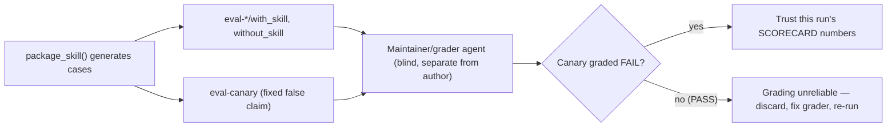

# Provenance-based trust for ADSK skill evals

## Why (evidence)

The article's model maps onto ADSK's eval stack at two layers, both already partially implemented:

- **Meta-eval layer** — [docs/evaluating-skills.md](docs/evaluating-skills.md) already splits grading into scripted/mechanical vs. LLM/semantic (line 85), and [scripts/check-skills-ci.sh](scripts/check-skills-ci.sh) already self-tests its Tier 1 deterministic gate via mutation fixtures (`run_self_test`, lines 293-390) — but nothing self-tests the Tier 2 **semantic** grader, and nothing requires the grader to be independent of the output's author (the article's "never let the author grade itself").
- **Skill-output layer** — skills that write to shared surfaces already practice informal evidence-gathering: `pull-request-authoring/SKILL.md:26` ("Gather evidence"), `supply-chain-gate/SKILL.md:21,48` ("Evidence first" / "Policy source cited"). None of them state the rule explicitly, so a future edit could silently regress to un-cited claims with nothing to catch it.

Confirmed via [scripts/run-skill-evals-soft.sh](scripts/run-skill-evals-soft.sh): Tier 2 is package-only (no LLM in CI — line 6 comment); all semantic grading happens in a maintainer-run agent loop. So the "test the grader" mechanism must be a **generated canary fixture + procedural requirement**, not a bash-level LLM self-test.

## Scope

Docs + one script + three skill gate lists. No runtime/behavior changes to how skills execute; this only tightens how their _evidence_ is graded and how three output-producing skills cite sources.

## Changes

### 1. Name the provenance hierarchy + weakest-link / stakes rules

File: [docs/evaluating-skills.md](docs/evaluating-skills.md), new subsection under `## Ground truth (ADSK)` (after the existing table, before "Scope of measured lift").

Add a short "Claim provenance" block (kept lean — a table + two one-line rules, not an essay):

| Class                   | Example in this repo                                                                                 |
| ----------------------- | ---------------------------------------------------------------------------------------------------- |
| Live observation        | `git diff`/`git log` read in `pull-request-authoring`; Socket PR comment read in `supply-chain-gate` |
| Authoritative reference | `references/policy-allowlist.md` / repo `SECURITY.md` citation                                       |
| Recorded context        | `references/project-context.md` loaded earlier in a `release-automation` run                         |
| Model memory            | Agent recalling an earlier turn without re-checking                                                  |
| Model knowledge         | General training knowledge, no source cited — weakest                                                |

Two rules, stated once: **(a)** a claim is only as strong as its weakest cited source; **(b)** higher-stakes surfaces (things other people/systems will act on — PR bodies, changelogs, merge/block verdicts) require higher-grade sources than a scratch note.

Update the existing `## Grading` section (line 83-85) to require evidence quotes be tagged by class where the grade is contestable, not just "quote paths or output."

### 2. Formalize author ≠ grader (blind grading)

File: [docs/evaluating-skills.md](docs/evaluating-skills.md) `## Grading` section + [skills/skill-optimizer/references/eval-loop.md](skills/skill-optimizer/references/eval-loop.md).

Add one explicit rule: the agent/session grading `with_skill` vs `without_skill` outputs must not be the same session that generated them, and should be blind to which arm is which until after grading (promote "blind A/B" from optional comparison technique to a grading requirement for semantic assertions). Add this as a line item to eval-loop.md's existing "Stop criteria" list.

### 3. Grader canary (closes the article's "quiet flaw" failure mode)

Files: [scripts/run-skill-evals-soft.sh](scripts/run-skill-evals-soft.sh) `package_skill()`, [skills/skill-optimizer/references/eval-loop.md](skills/skill-optimizer/references/eval-loop.md), [docs/evaluating-skills.md](docs/evaluating-skills.md) Tier 2 runbook.

`package_skill()` currently writes `eval-<id>/{with,without}_skill/grading.json` stubs per real case (lines 162-190). Add one extra generated `eval-canary/grading.json` per package: a fixed, deliberately-false assertion (e.g. `"assertion": "Output claims verification occurred that the transcript does not actually show", "result": "PENDING"`) that a correct grader must mark **FAIL**. Wire into:

- `scorecard-paste.md` checklist (line ~223-228): add "canary case graded FAIL — if it graded PASS, this run's grading is unreliable; do not paste these numbers."
- `run_self_test()` (line 414+): assert the canary directory/file is generated.
- eval-loop.md "Stop criteria": grading pass is only trustworthy if the canary failed as expected.

### 4. Stakes-tiered citation gate on shared-surface skills

Files (one line each, added to existing gate/checklist sections — not new sections):

- [skills/pull-request-authoring/SKILL.md](skills/pull-request-authoring/SKILL.md) `## Done checklist` (line 77-82): add "Claims in Summary/Changes trace to `git log`/`git diff` output actually gathered this run — not inferred from memory."
- [skills/release-automation/SKILL.md](skills/release-automation/SKILL.md) `### 5. Verify before done` (line 75-81): add "Platform/branch claims in `project-context.md` and `docs/RELEASE.md` cite the evidence gathered in step 2 (remotes/CI files), not assumption."
- [skills/supply-chain-gate/SKILL.md](skills/supply-chain-gate/SKILL.md) `## Done checklist` (line 46-50): already has "Policy source cited" (line 48) — extend it to also require the specific Socket alert/finding be named, not just the policy doc.

These formalize what each skill already does informally, so a future edit can't silently regress without a gate catching it.

### 5. SCORECARD provenance legend (small, optional but cheap)

File: [docs/evals/SCORECARD.md](docs/evals/SCORECARD.md), one-line addition near "Scoring axes" (line 7): note that Trust-column evidence should name its class (e.g. "in-repo Apache-2.0" = authoritative reference) rather than a bare number, consistent with rows that already do this (line 13, 18).

## Out of scope

- No new CI-blocking (Tier 3) gates — canary check stays a Tier 2 maintainer-run requirement, consistent with the kit's existing soft/hard split.
- No change to Tier 1 `check-skills-ci.sh` structural gates (they already have their own self-test pattern; this plan only extends Tier 2 semantic grading).
- No rewrite of skill bodies beyond the single-line gate additions in step 4.

## Verification

- `./scripts/check-skills-ci.sh` and `./scripts/check-skills-ci.sh --self-test` stay green (unchanged files).
- `./scripts/run-skill-evals-soft.sh --self-test` passes with the new canary-file assertion.
- `npx --yes skills-ref validate` still passes for the three edited skills (gate additions only, no frontmatter/structure change).
